<style>
  :root {
    --color-fg-default: #000;
    --color-canvas-default: #fff;
    /* ... */
  }
</style>

**Laboratório Hacker de Campinas (LHC), apresenta:**

# Explorando o NuttX com o ESP32

**Desenvolva Produtos de Forma Profissional**

<!-- footer:  Link para esta apresentação: [https://tmedicci.github.io/workshop-nuttx-lhc/](https://tmedicci.github.io/workshop-nuttx-lhc/) -->

<style>
footer {
    display: flex;
    align-items:center;
}
</style>

---

## Para os apressados e apressadas:

[Aqui](#maquina-virtual) está o slide com os links (e instruções) para baixar a máquina virtual para o workshop.

> Nota do autor: *podem ir baixando/instalando/atualizando, mas tentem prestar atenção na apresentação, hein!* :wink:

---

**Laboratório Hacker de Campinas (LHC), apresenta:**

# Explorando o NuttX com o ESP32

**Desenvolva Produtos de Forma Profissional**

---

## LHC?

O Laboratório Hacker de Campinas é *"hackerspace de Campinas que fornece um espaço aberto e comunitário para que entusiastas de tecnologia possam desenvolver seus projetos em áreas como eletrônica, robótica, mecânica, computação, jogos, culinária, artes, ou o que mais a criatividade e o espaço físico disponível permitirem."* (de [lhc.net.br](https://lhc.net.br))

---

### Workshop no LHC?

Este workshop é uma iniciativa minha - Tiago (membro do LHC desde 2018) - com o apoio de colegas. E, claro, é totalmente gratuito!

Gostou e quer ajudar de alguma forma? Faça uma doação ao LHC (pix para batman@lhc.net.br) e considere tornar-se um associado!

---

## Quem sou eu?

*Prazer, me chamo Tiago Medicci.*

Sou Engenheiro Eletricista e Mestre em Eng. Eletrônica pela Unicamp. Amante de eletrônica e áudio. Maker. Trabalho profissionalmente com o desenvolvimento de produtos e soluções de eletrônica embarcada desde 2014. Atualmente (jan/2024), sou Eng. de Software na Espressif, provendo suporte aos chips da família ESP32 para o NuttX.

---

## O que é o NuttX?

*ChatGPT-generated? Yes* :innocent:

O NuttX é um sistema operacional em tempo real (RTOS) que visa fornecer uma plataforma escalável e eficiente para sistemas embarcados. Ele é baseado no padrão POSIX e é projetado para ser altamente configurável e "portável".

---

### RTOS?

#### Software Embarcado

- Bare-metal;
- Sistemas operacionais:
  - Sistemas operaticionais de tempo real (RTOS);
  - Linux Embarcado;

---

### RTOS (Real Time Operating System)

#### Wikipedia (em tradução livre):

> Sistemas operacionais em tempo real são orientados a eventos e preemptivos, o que significa que o sistema operacional pode monitorar a prioridade relevante de tarefas concorrentes e fazer alterações na prioridade da tarefa. Sistemas orientados a eventos alternam entre tarefas com base em suas prioridades, enquanto sistemas de compartilhamento de tempo alternam a tarefa com base em interrupções de relógio.

https://en.wikipedia.org/wiki/Real-time_operating_system, acesso em 08/01/2024.

---

### RTOSes:

<iframe src="https://en.wikipedia.org/wiki/Comparison_of_real-time_operating_systems" height="80%" width="100%" frameBorder="1"></iframe>

---

## Por que o NuttX?

- Licença: Apache 2.0;
- Small footprint:
  - Suportado do Z80 a RISC-V 64 bits;
- Ampla comunidade;

**E...** :arrow_heading_down:

---

<style>
img[alt~="center"] {
  display: block;
  margin: 0 auto;
}
</style>


---

```c
#include <stdio.h>

int main() {
    printf("Hello, World!\n");
    return 0;
}
```

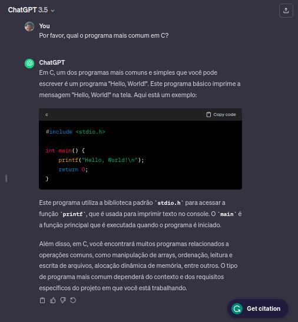

---

**Ainda perguntando ao chatGPT...** :thinking:


---

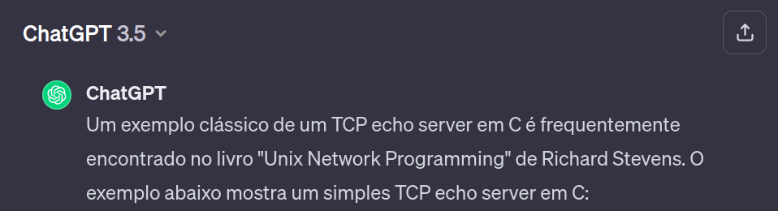

```c
#include <stdio.h>
#include <stdlib.h>
#include <string.h>
#include <unistd.h>
#include <arpa/inet.h>

#define PORT 8080
#define MAX_BUFFER_SIZE 1024

int main() {
    int server_socket, client_socket;
    struct sockaddr_in server_addr, client_addr;
    char buffer[MAX_BUFFER_SIZE];

    // Criação do socket
    if ((server_socket = socket(AF_INET, SOCK_STREAM, 0)) == -1) {
        perror("Erro ao criar o socket");
        exit(EXIT_FAILURE);
    }

    // Configuração do endereço do servidor
    server_addr.sin_family = AF_INET;
    server_addr.sin_addr.s_addr = INADDR_ANY;
    server_addr.sin_port = htons(PORT);

    // Associação do socket ao endereço
    if (bind(server_socket, (struct sockaddr*)&server_addr, sizeof(server_addr)) == -1) {
        perror("Erro ao associar o socket ao endereço");
        exit(EXIT_FAILURE);
    }

    // Coloca o socket em modo de escuta
    if (listen(server_socket, 5) == -1) {
        perror("Erro ao colocar o socket em modo de escuta");
        exit(EXIT_FAILURE);
    }

    printf("Servidor escutando na porta %d...\n", PORT);

    // Aguarda a conexão do cliente
    socklen_t client_addr_len = sizeof(client_addr);
    if ((client_socket = accept(server_socket, (struct sockaddr*)&client_addr, &client_addr_len)) == -1) {
        perror("Erro ao aceitar a conexão do cliente");
        exit(EXIT_FAILURE);
    }

    printf("Cliente conectado: %s\n", inet_ntoa(client_addr.sin_addr));

    // Loop para receber e enviar dados de volta ao cliente
    while (1) {
        ssize_t bytes_received = recv(client_socket, buffer, MAX_BUFFER_SIZE, 0);
        if (bytes_received <= 0) {
            printf("Conexão encerrada pelo cliente.\n");
            break;
        }

        printf("Recebido: %s", buffer);

        send(client_socket, buffer, bytes_received, 0);
        memset(buffer, 0, sizeof(buffer));
    }

    // Fechamento dos sockets
    close(client_socket);
    close(server_socket);

    return 0;
}
```

---

## Por que o NuttX?

- Licença: Apache 2.0;
- Small footprint:
  - Suportado do Z80 a RISC-V 64 bits;
- Ampla comunidade;

**E...**:

---

## Por que o NuttX?

- Licença: Apache 2.0;
- Small footprint:
  - Suportado do Z80 a RISC-V 64 bits;
- Ampla comunidade;
- **Compatível com o padrão POSIX!**

---

### POSIX?

De novo, do wikipedia :memo::

> POSIX (um acrônimo para: Portable Operating System Interface, que pode ser traduzido como Interface Portável entre Sistemas Operativos) é uma família de normas definidas pelo IEEE para a manutenção de compatibilidade entre sistemas operacionais e designada formalmente por IEEE 1003. POSIX define a interface de programação de aplicações (API), juntamente com shells de linha e comando e interfaces utilitárias, para compatibilidade de software com variantes de Unix e outros sistemas operacionais.

https://pt.wikipedia.org/wiki/POSIX, acesso em 13 de janeiro de 2024.

---

### POSIX! :raised_hands:

De novo, do wikipedia:

> **Tem como objetivo garantir a portabilidade do código-fonte de um programa a partir de um sistema operacional que atenda às normas POSIX para outro sistema POSIX, desta forma as regras atuam como uma interface entre sistemas operacionais distintos.**

https://pt.wikipedia.org/wiki/POSIX, acesso em 13 de janeiro de 2024.

---

### POSIX :heart:

<sub>*O Super Trunfo do NuttX!* :punch:</sub>

#### [Reinventing the wheel](https://en.wikipedia.org/wiki/Reinventing_the_wheel) :negative_squared_cross_mark:

Alguém já teve que fazer ~~quase~~ a mesma aplicação que você!

#### [Code reuse](https://en.wikipedia.org/wiki/Code_reuse) :white_check_mark:

Provavelmente, esta aplicação já foi desenvolvida para sistemas operacionais Unix com interfaces POSIX :wink:

---

#### Complete os espaços em branco :writing_hand:

*"Ah, mas o meu programa é muito específico! Ele lê um dado do sensor ________ pela interface ________ e depois manda para ________ via ________."*

OK, mas alguém *provavelmente*:
1. Já implementou um driver para ler o sensor em sistema Linux (incluindo o acesso à interface);
2. Já criou uma aplicação que recebe dados genéricos e os processa (enviando através de alguma interface de rede, por exemplo).

---

##### Por exemplo...

###### Placa de som via Wi-Fi :speaker:

Utilizar o ESP32 como uma placa de áudio externa que recebe pacotes via rede Wi-Fi e reproduzi-lo em um codec de áudio I2S.

**Trabalhoso?** :tired_face:

---

###### Solução :clipboard:

Existe (desde 1996) um protocolo de rede chamado *RTP* (Real-Time Protocol) que é capaz de enviar e receber pacotes de áudio pela rede.

[***RTP Tools***](https://github.com/irtlab/rtptools)

*RTP Tools is a set of small applications that can be used for processing RTP data.*

:arrow_right: Utiliza interfaces POSIX para receber pacotes RTP pela rede

---

###### Quer saber mais? :nerd_face:

Artigo no *embarcados.com.br* :books:

[***NuttX: Criando (ou Copiando!) uma Aplicação para o NuttX***](https://embarcados.com.br/nuttx-criando-ou-copiando-uma-aplicacao-para-o-nuttx/)

---

##### Aliás... :books:

Uma série de artigos em português no *embarcados.com.br*:
###### [*Primeiros Passos com o ESP32 e NuttX*](https://embarcados.com.br/serie/primeiros-passos-com-o-esp32-e-o-nuttx/)

<iframe src="https://embarcados.com.br/serie/primeiros-passos-com-o-esp32-e-o-nuttx/" height="300px" width="100%" frameBorder="0"></iframe>

---

## Espressif ESP32

- Primeira versão lançada oficialmente em 6 de setembro de 2016;
- Sucessor do ESP8266 (*"IoT Game Changer"*);
- Focado em conectividade!
  - Wi-Fi e Bluetooth;

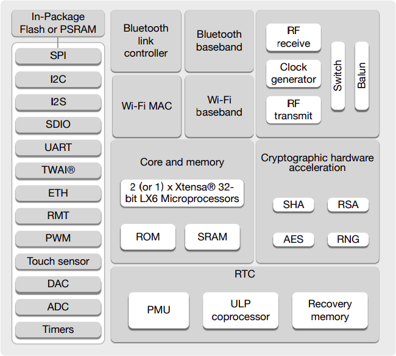

---

### ESP32 e o NuttX :computer:

- Primeiro commit em out/2016 (sim, um mês depois do lançamento!) pelo próprio Gregory Nutt (criador do NuttX);
- Em 29 de outubro de 2021 a Espressif anuncia oficialmente o suporte aos OSes NuttX e Zephyr (além, claro, do ESP-IDF, que continua sendo o OS oficial da Espressif para o ESP32);
- ESP32, ESP32-S2, ESP32-S3, ESP32-C3, ESP32-C6 e ESP32-H2 são suportados no NuttX hoje (23/01/2024);

---

### ESP32 e o NuttX :computer:

[Documentação do ESP32 no NuttX](https://nuttx.apache.org/docs/latest/platforms/xtensa/esp32/index.html):

<iframe src="https://nuttx.apache.org/docs/latest/platforms/xtensa/esp32/index.html" height="600px" width="100%" frameBorder="0"></iframe>

---

## Mão na Massa! :construction_worker:

---

Ok, são inúmeros os tutoriais de como configurar o ambiente de build, mas não teremos tempo de fazer estas etapas hoje. Para agilizar, disponibilizamos uma máquina virtual (VM) que pode ser importada pelo VirtualBox no Linux ou no Windows.

*Mas VMs são pesadas, quero fazer tudo na mão!* :nerd_face:

OK, temos uma imagem docker para você também [aqui](#docker-nuttx).

---

### Máquina Virtual <a id="maquina-virtual"></a>

Para facilitar os experimentps, disponibilizei uma máquina virtual já configurada com o ambiente de desenvolvimento do NuttX configurado e testado!

#### Instruções:
1. Baixe e instale o [VirtualBox](https://www.virtualbox.org/wiki/Downloads);
2. Baixe o arquivo disponibilizado **.ova*: [https://bit.ly/nuttx-vm-ova](https://bit.ly/nuttx-vm-ova)
3. Siga as instruções disponibilizadas na sessão [*"Importing an OVA"*](https://www.maketecheasier.com/import-export-ova-files-in-virtualbox/#importing-an-ova)

---

### Máquina Virtual

#### Autorizando o acesso aos dispositivos USB (no caso, a placa com o ESP32)

No linux, você precisa ter certeza que seu usário pertence ao grupo `vboxusers`:

```
$ sudo groupadd vboxusers
$ sudo gpasswd -a $USER vboxusers
```

Reinicie o computador para a mudança ter efeito!

---

### Máquina Virtual

#### Configurando a porta USB da placa do ESP32 na VM:

1. Em configurações (*Settings*), navegue até a aba `USB`;
2. Adicione o dispositivo que contenha algo como `USB to UART` clicando no ícone ;
3. Clique em `OK` para confirmar e sair da tela;

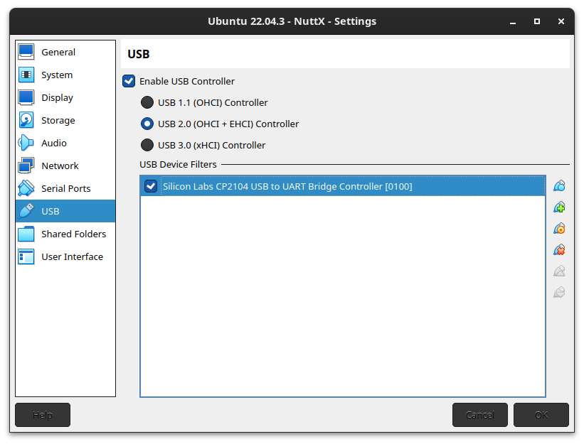

---

### Máquina Virtual

#### Iniciando a VM:

1. Clique em `Start` no VirtualBox para iniciar a VM;
2. Na área de trabalho, o arquivo `Dados.txt` contém dados da VM;

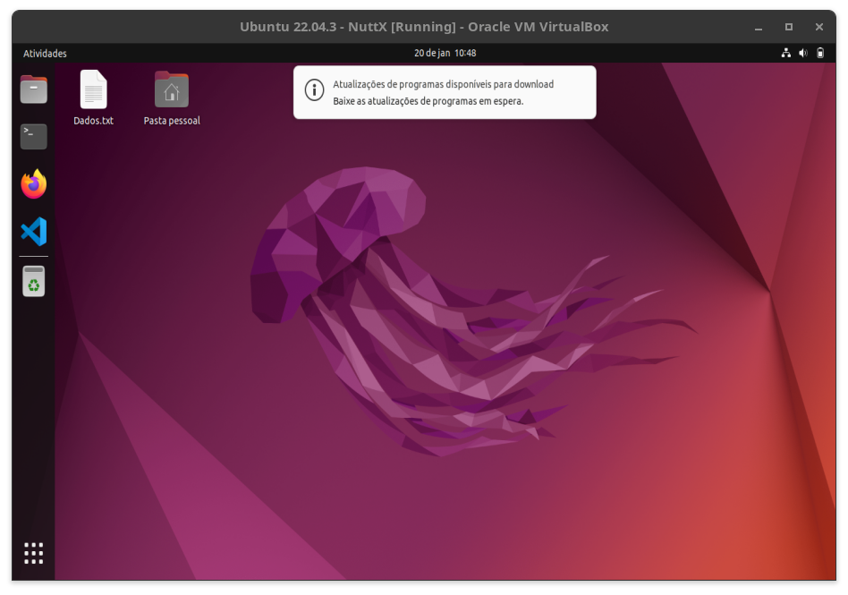

---

### Máquina Virtual

#### Iniciando a VM:

3. O ambiente do NuttX já foi baixado e está em `/home/nuttx/Documentos/nuttxspace`. Abra o terminal e navegue até este local!

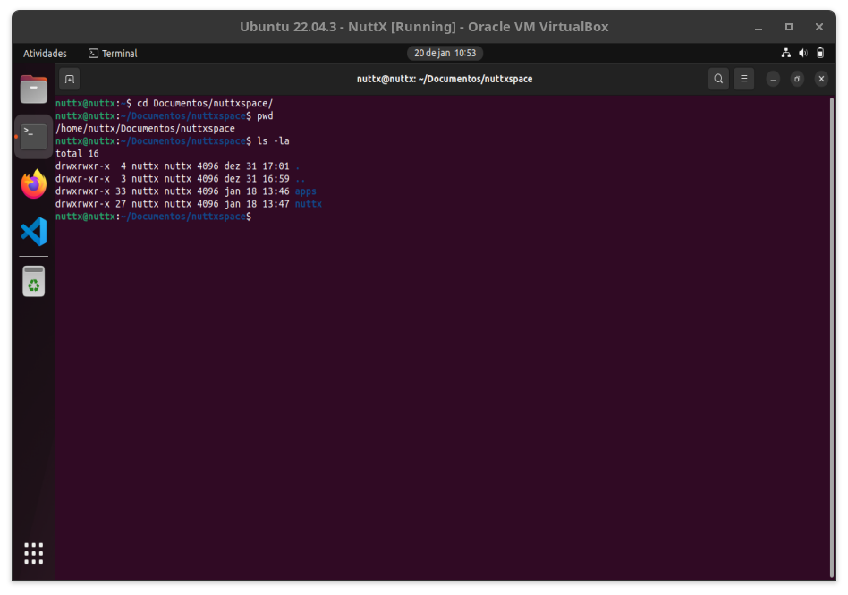

---

### Ambiente de Desenvolvimento via Docker <a id="docker-nuttx"></a>

 A imagem docker que o NuttX utiliza em seu CI pode ser usada sem problemas :wink:

Antes de executar o docker, porém, precisamos clonar o repositório do NuttX no computador host:

```
mkdir nuttxspace
cd nuttxspace
git clone https://github.com/apache/nuttx.git nuttx
git clone https://github.com/apache/nuttx-apps apps

```

---

### Ambiente de Desenvolvimento via Docker

Na pasta `nuttxspace`, execute:

```
docker run -it --rm \
        -v `pwd`:/sources \
        --workdir=/sources \
        --env REMOTE_USER="builder" \
        --env NEW_UID=$(id -u) \
        --env NEW_GID=$(id -g) \
        --device=/dev/ttyUSB0 \
        ghcr.io/apache/nuttx/apache-nuttx-ci-linux
```

---

#### Exemplo de Aplicação: Cliente MQTT

**Objetivo da parte prática:** implementar um cliente MQTT! Ideias?

---

#### Exemplo de Aplicação: Cliente MQTT (MQTT-C)

##### Não reinventar a roda!

 [https://github.com/LiamBindle/MQTT-C](https://github.com/LiamBindle/MQTT-C)

---

#### Exemplo de Aplicação: Cliente MQTT (MQTT-C)

E, na documentação do NuttX:

 https://nuttx.apache.org/docs/latest/applications/examples/mqttc/index.html:

<iframe src="https://nuttx.apache.org/docs/latest/applications/examples/mqttc/index.html" height="80%" width="100%" frameBorder="1"></iframe>

---

#### Exemplo de Aplicação: Cliente MQTT (MQTT-C)

E, agora que a VM (ou o Docker) já estão prontinhos:

##### Configurando o NuttX para compilar o MQTT-C :gear:

Partindo de uma configuração já existente, vamos selecionar o MQTT-C:

1. Na pasta `nuttx`, limpe o ambiente: `make distclean`;
2. Carregue a configuração do ESP32: `/tools/configure.sh -l esp32-devkitc:wifi`;
3. Abra o `make menuconfig` para selecionarmos a aplicação do MQTT-C;

---

#### Exemplo de Aplicação: Cliente MQTT (MQTT-C)

##### Configurando o NuttX para compilar o MQTT-C :gear:

4. No `menuconfig`, use a tecla `/` para pesquisar por `mqtt`;
5. Navegue com as teclas de direção até a opção `NETUTILS_MQTTC` e selecione com `ENTER`

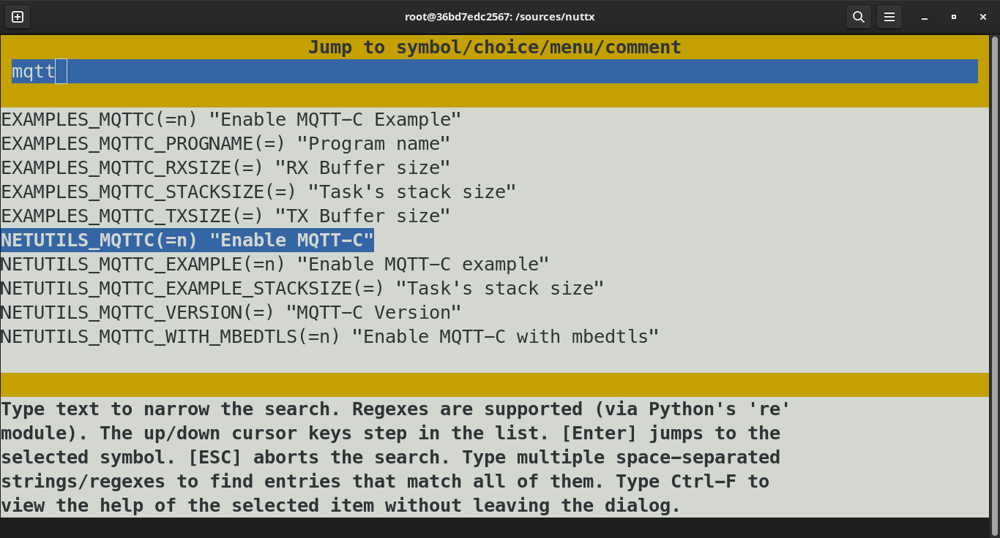

---

#### Exemplo de Aplicação: Cliente MQTT (MQTT-C)

##### Configurando o NuttX para compilar o MQTT-C :gear:

6. Com a tecla `y`, marque as opções `Enable MQTT-C` e `Enable MQTT-C example`;

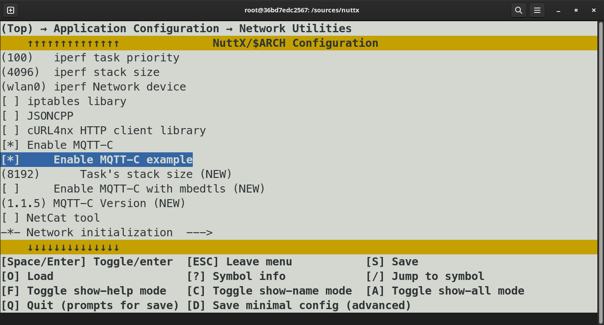

---

#### Exemplo de Aplicação: Cliente MQTT (MQTT-C)

##### Configurando o NuttX para compilar o MQTT-C :gear:

7. Pressione a tecla `Esc` múltiplas vezes (para voltar às telas anteriores) até aparecer a opção para salvar. Clique em `y` para salvar e sair;

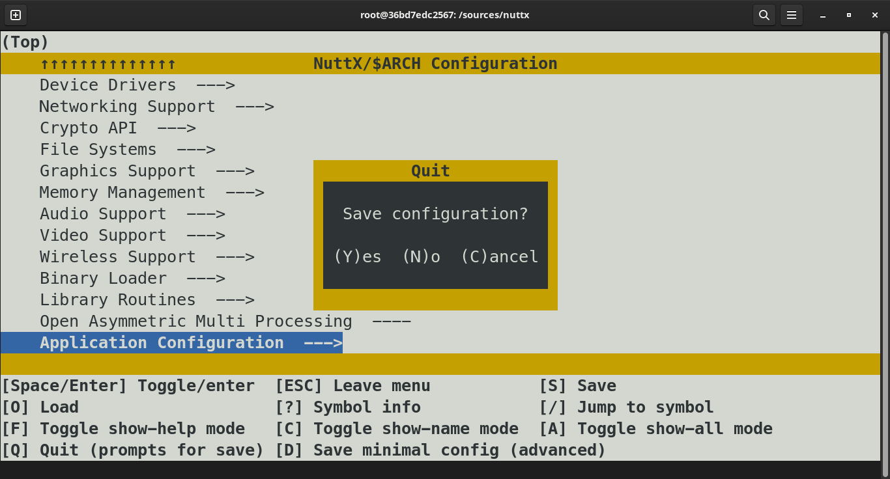

---

#### Exemplo de Aplicação: Cliente MQTT (MQTT-C)

##### Compilando o NuttX e gravando no ESP32 :hammer:

1. Primeiro, compile o bootloader do ESP32 `make bootloader`;
2. Depois, compile e grave o NuttX com `make -j flash ESPTOOL_BINDIR=./ ESPTOOL_PORT=/dev/ttyUSB0`. Tome um café :coffee:

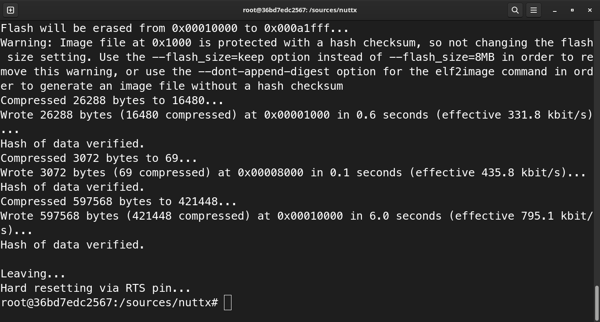

---

#### Exemplo de Aplicação: Cliente MQTT (MQTT-C)

##### Executando o terminal do NuttX no ESP32 :computer:

1. Agora, podemos abrir um aplicativo como o `minicom` para ter acesso ao terminal através da porta serial `/dev/ttyUSB0` (115kps, 8N1):
    1. Para os usuários da VM, o `minicom` já está instalado e configurado. Basta executar `minicom`.
    2. Para quem estiver usando o ambiente docker, o minicom pode ser instalado  direto no contêiner com `apt update && apt install minicom`. Não se esqueça de configurá-lo para 1) desligar o controle de fluxo por HW e 2) configurar o baud rate:

---

#### Exemplo de Aplicação: Cliente MQTT (MQTT-C)

##### Executando o terminal do NuttX no ESP32 :computer:

2. Bem vindo ao terminal do NuttX (NSH): digite `help` para ver as aplicações e comandos disponíveis!

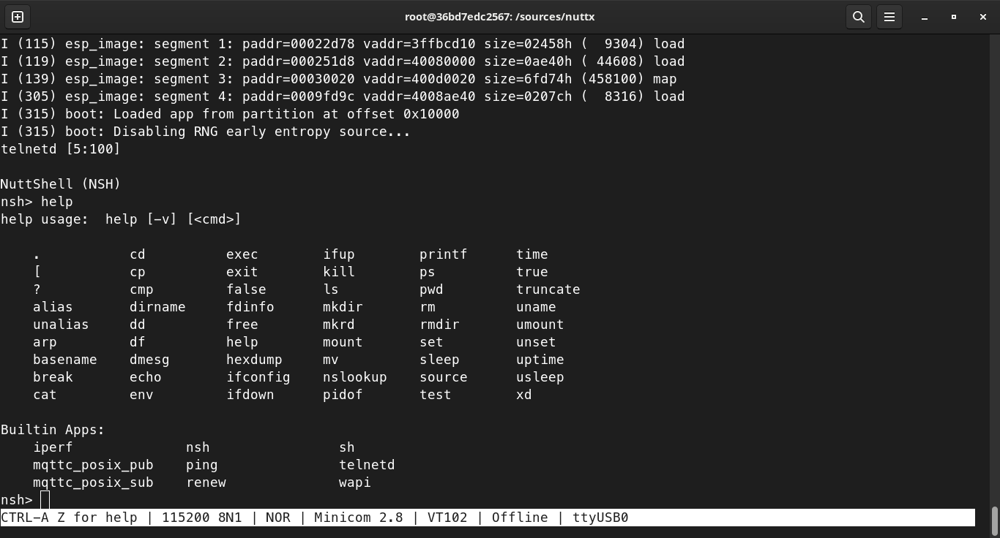

---

#### Exemplo de Aplicação: Cliente MQTT (MQTT-C)

##### Conectando-se à rede Wi-Fi :satellite:

1. Use a aplicação `wapi`: `wapi psk wlan0 <senha> 3` e `wapi essid wlan0 <rede> 1`;
2. Atualize o IP através do DHCP server: `renew wlan0`;
3. Cheque a conexão com `ifconfig`;

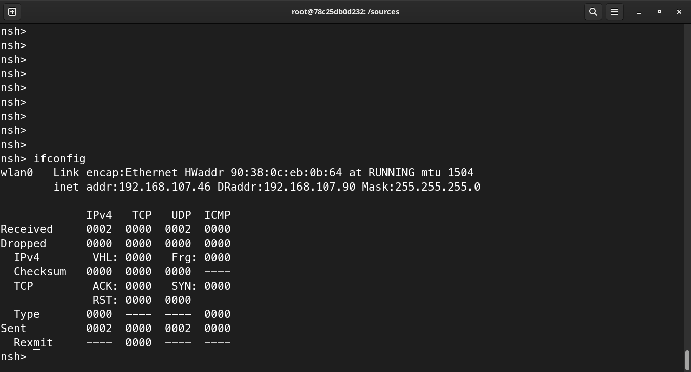

---

#### Exemplo de Aplicação: Cliente MQTT (MQTT-C)

##### Recebendo mensagens via MQTT :email:

1. "Pingue" o endereço do broker: `ping -c 2 <ip_do_broker>`
    1. Qual o endereço do Broker?
2. Execute a aplicação de exemplo do MQTT-C que subscreve no tópico *datetime*: `mqttc_posix_sub 192.168.107.170 &`
    1. Sim, estamos executando a aplicação em segundo plano. O NuttX permite isso!
    2. Sim, em segundo plano, continuamos tendo acesso ao terminal do NuttX;

---

#### Exemplo de Aplicação: Cliente MQTT (MQTT-C)

##### Recebendo mensagens via MQTT :email:

3. Verifique se, após o envio da mensagem para o tópico *datetime*, ela foi recebida pelo NuttX:

```
Received publish('datetime'): The time is 2024-01-20 12:22:37
```

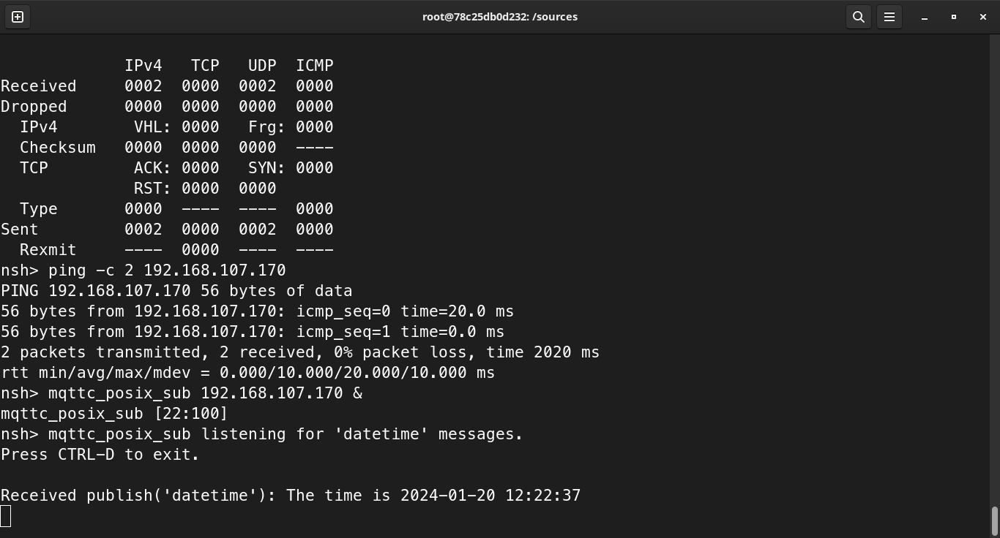

---

## Dúvidas, Perguntas e Sugestões :memo:

Este workshop é uma introdução ao NuttX com o ESP32. Muito conteúdo ficou de fora, eu sei, mas espero que tenham gostado!

### Obrigado!

 - [https://github.com/tmedicci](https://github.com/tmedicci)
 - [https://www.linkedin.com/in/tmedicci/](https://www.linkedin.com/in/tmedicci/)

---

## Referências Gerais

- Página Oficial do NuttX: [https://nuttx.apache.org/](https://nuttx.apache.org/)
- Documentação Oficial do NuttX: [https://nuttx.apache.org/docs/latest/](https://nuttx.apache.org/docs/latest/)
- Kernel do NuttX no GitHub: [https://github.com/apache/nuttx](https://github.com/apache/nuttx)
- Aplicações do NuttX no GitHub: [https://github.com/apache/nuttx-apps](https://github.com/apache/nuttx-apps)
